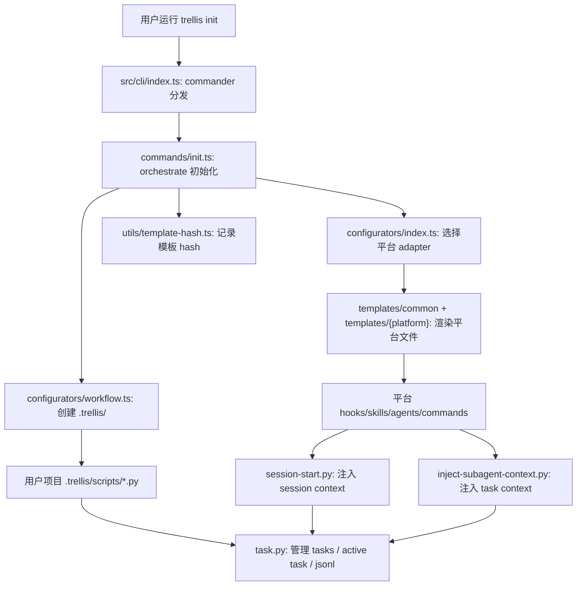
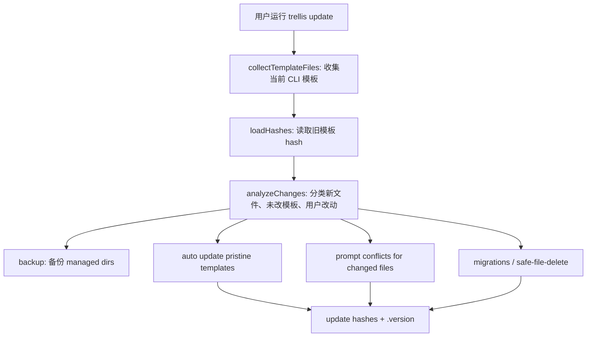

# Trellis 核心模块中文学习文档

> 面向画像：TypeScript 经验较多、偏前端、正在研究 CLI、对函数式思想有兴趣的开发者。
>
> 目标：用一条清晰路线快速建立 Trellis 的 mental model，然后能独立读懂 `init`、`update`、platform adapter、template、hook、task runtime 这些核心模块。

## 0. 推荐阅读顺序

如果你只想先上手，不要从所有文件平铺开始。建议按这个顺序读：

1. `README.md`：先理解 Trellis 的产品层抽象。
2. `packages/cli/package.json`：知道 CLI 怎么构建、测试、发布，以及依赖边界。
3. `packages/cli/src/cli/index.ts`：命令入口，确认用户输入如何分发。
4. `packages/cli/src/commands/init.ts`：第一次安装 Trellis 的完整链路。
5. `packages/cli/src/configurators/index.ts` + `packages/cli/src/types/ai-tools.ts`：多平台抽象的中心。
6. `packages/cli/src/configurators/workflow.ts` + `packages/cli/src/templates/`：`.trellis/` 和平台文件是怎么生成的。
7. `packages/cli/src/commands/update.ts` + `packages/cli/src/utils/template-hash.ts`：更新、冲突判断、保护用户文件。
8. `packages/cli/src/templates/shared-hooks/` 和 `packages/cli/src/templates/trellis/scripts/`：安装到用户项目后的运行期。
9. `packages/cli/test/`：用测试反查模块契约。

常用 fish 命令：

```fish
pnpm --filter @mindfoldhq/trellis test
pnpm --filter @mindfoldhq/trellis typecheck
pnpm --filter @mindfoldhq/trellis lint

rg "export async function init" packages/cli/src
rg "collectTemplateFiles|analyzeChanges" packages/cli/src/commands/update.ts
rg "AI_TOOLS|TemplateContext" packages/cli/src/types packages/cli/src/configurators
```

## 1. 架构视角

### 1.1 Trellis 到底是什么

Trellis 不是一个长期运行的 server，也不是一个前端 app。它更像一个“AI coding harness 安装器 + 运行期脚本包”。

从 README 的产品模型看，Trellis 安装后会在用户项目中建立这些层：

| 层 | 作用 |
| --- | --- |
| `.trellis/spec/` | 团队工程规范，供 agent 按需加载 |
| `.trellis/tasks/` | PRD、任务状态、上下文 jsonl、验收标准 |
| `.trellis/workspace/` | 开发者 journal、会话记忆 |
| `.trellis/workflow.md` | 规划、实现、检查、收尾的共享生命周期 |
| 平台 adapters | 写入 Claude、Cursor、Codex、Gemini 等平台自己的 commands、skills、hooks、agents |

源码里可以把它拆成两大系统：

| 系统 | 语言 | 生命周期 | 代表目录 |
| --- | --- | --- | --- |
| CLI 安装/更新系统 | TypeScript | 运行在 `trellis init/update/uninstall` 时 | `packages/cli/src/commands`、`configurators`、`templates`、`utils` |
| 项目运行期系统 | Python + 平台模板 | 被安装到用户项目后，在 AI session/hook/task 操作中运行 | `packages/cli/src/templates/trellis/scripts`、`templates/shared-hooks` |

可以把 TypeScript 侧理解成“把一套运行期资产投影到不同 AI 平台”；Python 侧理解成“被投影后的本地 runtime”。

### 1.2 包结构地图

核心包是 `packages/cli`。

| 路径 | 主要职责 |
| --- | --- |
| `packages/cli/bin/trellis.js` | npm bin 入口，动态 import 编译后的 `dist/cli/index.js` |
| `packages/cli/src/cli/index.ts` | commander 命令注册、错误边界、版本提示 |
| `packages/cli/src/commands/` | 用户可运行命令：`init`、`update`、`uninstall` |
| `packages/cli/src/configurators/` | 各 AI 平台文件写入逻辑，以及平台 registry |
| `packages/cli/src/templates/` | 所有被写入用户项目的模板源 |
| `packages/cli/src/utils/` | 文件写入、模板 hash、项目检测、远程模板拉取等基础能力 |
| `packages/cli/src/migrations/` | 版本迁移 manifest 加载与筛选 |
| `packages/cli/src/constants/` | 路径、版本等常量 |
| `packages/cli/src/types/` | 平台、迁移、模板上下文等类型 |
| `packages/cli/test/` | 命令、配置器、模板、工具函数的测试 |

### 1.3 数据和副作用边界

从函数式视角看，这个项目不是 Effect 风格代码，也没有显式 IO monad，但它天然存在一个“纯数据 -> 解释执行”的结构：

| 概念 | 在 Trellis 中的形态 |
| --- | --- |
| ADT / 判别联合 | `AITool`、`CliFlag`、`TemplateDir`、migration item `type` |
| Registry as data | `AI_TOOLS` 是平台能力的单一事实源 |
| Interpreter | `configurators/index.ts` 根据平台数据调用具体 `configure*` |
| Pure-ish transform | `resolvePlaceholders`、`replacePythonCommandLiterals`、`computeHash` |
| Effect boundary | `writeFile`、`fs.*`、`execSync`、network fetch、inquirer prompt |

读代码时可以问自己两个问题：

1. 这个函数是在“计算应该写什么”，还是在“真的写入磁盘/问用户/访问网络”？
2. 这个新增平台/新增模板能不能只改 registry 和模板，而不是到处加 if？

这会比按文件名硬记更快。

## 2. 核心逻辑链

### 2.1 `trellis` 命令启动链路

入口链路：

```text
packages/cli/bin/trellis.js
  -> dist/cli/index.js
  -> src/cli/index.ts
  -> commander 注册 init/update/uninstall
  -> commands/*
```

`src/cli/index.ts` 做三件事：

1. 如果当前目录已有 `.trellis/`，读取 `.trellis/.version`，和 CLI 自己的 `VERSION` 比较，给出升级提示。
2. 用 commander 注册 `init`、`update`、`uninstall`。
3. 每个 command 的 action 只做错误边界，具体逻辑交给 `commands/init.ts` 等模块。

这里的风格很 CLI：入口层不吞复杂业务，只负责参数解析和用户可见错误输出。命令实现内部抛错，入口统一 `process.exit(1)`。

### 2.2 `trellis init` 主链路

`init` 是最值得优先读的文件，因为它展示了 Trellis 的大部分设计。

简化链路：

```text
init(options)
  -> 设置代理、写入模式、开发者名
  -> 检查 Python >= 3.9
  -> 如果已初始化，走 re-init 分支
  -> 检测项目类型和 monorepo
  -> 可选下载远程 spec template
  -> createWorkflowStructure()
  -> configurePlatform(platformId, cwd)
  -> initializeHashes()
  -> 写 .version
  -> 初始化 developer
  -> 创建 bootstrap 或 joiner task
```

关键点：

| 步骤 | 关键文件 | 解释 |
| --- | --- | --- |
| 参数和模式 | `commands/init.ts` | `--force`、`--skip-existing`、`--yes` 会映射到 `WriteMode` |
| Python 检查 | `commands/init.ts` | hook/runtime 依赖 Python，最低 3.9 |
| 项目检测 | `utils/project-detector.ts` | 通过文件、依赖、workspace 判断项目类型和 monorepo |
| `.trellis/` 结构 | `configurators/workflow.ts` | 写 workflow、config、scripts、workspace、tasks、spec、user |
| 平台配置 | `configurators/index.ts` | 根据选择的平台调用 `configureClaude`、`configureCodex` 等 |
| 模板 hash | `utils/template-hash.ts` | 初始化 `.trellis/.template-hashes.json`，供 update 判断用户是否改过模板 |
| bootstrap task | `commands/init.ts` | 首次创建项目时生成 `00-bootstrap-guidelines` |
| joiner task | `commands/init.ts` | 新开发者加入已有 Trellis 项目时生成 onboarding task |

这条链路最核心的理念是“先生成一套本地工作流 runtime，再生成平台适配入口”。`.trellis/` 是平台无关的核心，`.claude/`、`.cursor/`、`.codex/` 等是平台投影。

### 2.3 平台 adapter 链路

平台抽象由两个文件共同支撑：

| 文件 | 角色 |
| --- | --- |
| `types/ai-tools.ts` | 声明平台数据：平台 ID、CLI flag、config 目录、是否有 hooks、是否支持 sub-agent、template context |
| `configurators/index.ts` | 声明平台行为：每个平台如何 configure，update 时如何 collect templates |

`AI_TOOLS` 很像一个 ADT 的“构造值表”。例如 Codex 的配置会说：

| 字段 | 含义 |
| --- | --- |
| `configDir: ".codex"` | 用什么目录判断 Codex 已配置 |
| `supportsAgentSkills: true` | 同时写 `.agents/skills/` 共享层 |
| `cliFlag: "codex"` | 对应 `trellis init --codex` |
| `templateContext.cmdRefPrefix: "$"` | 渲染模板时命令引用长什么样 |
| `agentCapable: true` | 是否适合 implement/check sub-agent 流程 |
| `hasHooks: false` | 是否有平台 hook 系统 |

`configurators/index.ts` 再把这个数据解释成文件集合：

```text
AI_TOOLS.codex.templateContext
  -> resolveAllAsSkills(ctx)
  -> collectSkillTemplates(".agents/skills", ...)
  -> getCodexAgents()
  -> getCodexHooks()
  -> getCodexHooksConfig()
  -> Map<relativePath, content>
```

新增平台时，真正的“清单”已经写在 `types/ai-tools.ts` 注释里：

1. 加 `AI_TOOLS` 数据。
2. 加 `src/configurators/{platform}.ts`。
3. 加 `src/templates/{platform}/`。
4. 在 `configurators/index.ts` 注册行为。
5. 在 CLI init flags 和 tests 中补齐。

### 2.4 模板渲染链路

Trellis 的模板不是只有一类。大致分三种：

| 模板类型 | 路径 | 生成目标 |
| --- | --- | --- |
| `.trellis/` runtime 模板 | `templates/trellis/` | 用户项目的 `.trellis/` |
| 跨平台 commands/skills | `templates/common/` | 各平台的 slash commands、skills、workflows |
| 平台专属模板 | `templates/{platform}/` | hooks、agents、settings、config |

关键函数：

| 函数 | 文件 | 作用 |
| --- | --- | --- |
| `createWorkflowStructure` | `configurators/workflow.ts` | 创建 `.trellis/` 目录结构 |
| `copyTrellisDir` | `templates/extract.ts` | 从模板目录复制 scripts，并设置可执行位 |
| `getAllScripts` | `templates/trellis/index.ts` | 枚举 `.trellis/scripts` 模板内容 |
| `getCommandTemplates` / `getSkillTemplates` | `templates/common/index.ts` | 读取 common commands/skills |
| `resolvePlaceholders` | `configurators/shared.ts` | 处理 `{{PYTHON_CMD}}`、`{{CMD_REF:name}}`、条件块等 |
| `wrapWithSkillFrontmatter` | `configurators/shared.ts` | 把 common skill 渲染成 Codex/Kiro/Qoder 等平台需要的 `SKILL.md` 格式 |

这部分可以类比前端里的“design token + component render”。`TemplateContext` 像 props，common template 像组件源码，不同平台 configurator 像不同 renderer。

### 2.5 `trellis update` 主链路

`update` 的本质是：CLI 版本升级后，把 Trellis 管理的模板更新到用户项目，同时不破坏用户自己的任务、spec、workspace 和手工改动。

简化链路：

```text
update(options)
  -> 读取已安装版本和 CLI 版本
  -> 收集待更新模板 collectTemplateFiles()
  -> 加载 .template-hashes.json
  -> analyzeChanges()
  -> 备份 managed dirs
  -> 自动更新 pristine templates
  -> 对用户改过的文件交互询问
  -> 执行 migrations / safe-file-delete
  -> 更新 hash 和 .version
```

关键分类在 `analyzeChanges`：

| 分类 | 含义 | 默认行为 |
| --- | --- | --- |
| `newFiles` | 新模板文件，磁盘不存在且无旧 hash | 添加 |
| `unchangedFiles` | 当前内容已经等于新模板 | 跳过 |
| `autoUpdateFiles` | 用户没改过，但模板内容变了 | 自动更新 |
| `changedFiles` | 用户改过，或无法证明没改 | 询问 overwrite/skip/create-new |
| `userDeletedFiles` | 旧 hash 存在但磁盘文件被删 | 尊重删除 |
| `protectedPaths` | 用户数据目录 | 永远保护 |

这套机制的核心是 `.trellis/.template-hashes.json`：

```text
模板安装时 hash A
更新时读取当前文件 hash B
新 CLI 模板内容 hash C

如果 A == B 且 B != C：用户没改过，可以自动升级到 C
如果 A != B：用户改过，进入冲突处理
```

值得注意的保护目录：

```text
.trellis/workspace/
.trellis/tasks/
.trellis/spec/
.trellis/user/
.trellis/.developer
.trellis/.current-task
```

这解释了 Trellis 的价值观：模板和平台 glue 可以更新，但用户知识资产和任务资产不能被 CLI 随便覆盖。

### 2.6 SessionStart 和 sub-agent context 链路

安装完成后，运行期重点就转到 Python hooks。

`shared-hooks/session-start.py` 负责 session 启动时注入上下文：

```text
平台 SessionStart hook
  -> session-start.py
  -> 定位项目目录和 .trellis/
  -> 解析 session identity
  -> 运行 .trellis/scripts/get_context.py
  -> 抽取 workflow.md 的 Phase Index 和阶段细节
  -> 列出 spec indexes
  -> 判断当前 task 状态
  -> 输出 additionalContext
```

它注入的信息包括：

| 信息 | 来源 |
| --- | --- |
| 开发者身份 | `.trellis/.developer` |
| git 状态和近期 commits | `common/session_context.py` |
| 当前 active task | `common/active_task.py` |
| active tasks 列表 | `.trellis/tasks/*/task.json` |
| workflow 阶段提示 | `.trellis/workflow.md` |
| spec index 列表 | `.trellis/spec/**/index.md` |

`shared-hooks/inject-subagent-context.py` 负责 sub-agent 启动前补充任务上下文：

```text
平台 PreToolUse / BeforeTool hook
  -> 发现正在 spawn trellis-implement / trellis-check / trellis-research
  -> 解析当前 active task
  -> 读取 implement.jsonl 或 check.jsonl
  -> 读取 prd.md / info.md
  -> 重写 sub-agent prompt
```

这就是 Trellis 的“少量上下文常驻 + 任务上下文按需注入”模型。

### 2.7 Task runtime 链路

用户项目里的 task 操作入口是：

```text
.trellis/scripts/task.py
```

模板源在：

```text
packages/cli/src/templates/trellis/scripts/task.py
```

`task.py` 本身像 CLI router，真实逻辑被拆到 `common/`：

| 模块 | 职责 |
| --- | --- |
| `common/task_store.py` | create、archive、set branch、subtask link |
| `common/task_context.py` | implement/check jsonl 添加、校验、列出 |
| `common/active_task.py` | session-scoped active task 解析、设置、清除 |
| `common/tasks.py` | 遍历和读取 task |
| `common/session_context.py` | 生成 session context 文本/JSON |
| `common/packages_context.py` | 读取 monorepo package/spec 信息 |
| `common/workflow_phase.py` | 从 workflow.md 抽取 Phase Index 或具体 step |

一个 task 创建后的核心文件：

| 文件 | 作用 |
| --- | --- |
| `task.json` | 结构化任务状态、owner、branch、subtasks、metadata |
| `prd.md` | 需求、验收标准、技术决策 |
| `implement.jsonl` | implement sub-agent 需要加载的 spec/research 文件 |
| `check.jsonl` | check sub-agent 需要加载的 spec/research 文件 |
| `info.md` | 可选技术设计 |
| `research/*.md` | research sub-agent 持久化结果 |

从数据流看，`prd.md` 是需求 source of truth，`task.json` 是状态 source of truth，`jsonl` 是上下文加载 manifest。

## 3. 关键模块代码分析

### 3.1 `src/cli/index.ts`

这个文件是最薄的一层，但非常适合作为 CLI 学习入口。

你要看四个点：

1. `checkForUpdates(cwd)`：说明 CLI 启动时会读取项目 `.trellis/.version`，提示用户更新。
2. `new Command()`：commander 的典型结构。
3. `.command("init")`、`.option(...)`、`.action(...)`：参数定义和 action 分发。
4. `try/catch`：命令错误在入口层统一格式化，debug 模式才打印 stack。

学习提示：如果你从前端切过来，可以把 commander 命令理解成 router。`action` 类似 route handler，但 Trellis 让 handler 很薄，把业务放到 `commands/*`。

### 3.2 `commands/init.ts`

这个文件很长，因为 `init` 是一次完整 bootstrap。

建议按“阶段”读，不要逐行读：

| 阶段 | 关键词 |
| --- | --- |
| 前置能力 | Python 版本、OS、开发者名、write mode |
| 首次/再次 init 分流 | `isFirstInit`、`handleReinit`、`tasksEmptyEarly` |
| 项目识别 | `detectProjectType`、`detectMonorepo` |
| 远程模板 | `fetchTemplateIndex`、`downloadTemplateById` |
| 本地结构 | `createWorkflowStructure` |
| 平台写入 | `configurePlatform` |
| hash 初始化 | `initializeHashes` |
| task 初始化 | `createBootstrapTask`、`createJoinerOnboardingTask` |

值得细看的函数：

| 函数 | 为什么重要 |
| --- | --- |
| `requireSupportedPython` | 运行期依赖前置校验的例子 |
| `slugifyDeveloperName` | 用户输入清洗，支持 Unicode 名字 |
| `writeTaskSkeleton` | task 目录最小结构 |
| `getBootstrapPrdContent` | Trellis 如何自举 `.trellis/spec/` 和 `.trellis/user/` |
| `handleReinit` | 已初始化项目如何安全追加平台或开发者 |
| `writeMonorepoConfig` | non-destructive config patch 的例子 |
| `init` | 总 orchestrator |

函数式视角：`init` 是一个大 effectful orchestration。它不适合硬改成纯函数，但很多子步骤本可以拆成“计算计划”和“执行计划”。现在代码中已经有这种影子，比如平台 registry 先 collect templates，再写文件。

### 3.3 `utils/file-writer.ts`

这是文件写入冲突策略的底层。

`WriteMode` 是一个小 ADT：

```ts
export type WriteMode = "ask" | "force" | "skip" | "append";
```

`writeFile` 的行为：

| 情况 | 行为 |
| --- | --- |
| 文件不存在 | 直接写 |
| 文件存在且内容相同 | 静默跳过 |
| `force` | 覆盖 |
| `skip` | 保留 |
| `append` | 追加 |
| `ask` + TTY | 交互询问 |
| `ask` + 非 TTY | 自动降级为 skip |

这里有一个 CLI 工程很重要的习惯：非交互环境不要突然 prompt。Trellis 用“默认保守跳过”避免 CI 或管道场景挂住。

### 3.4 `types/ai-tools.ts`

这是多平台抽象最值得读的类型文件。

重点不是语法，而是建模：

```ts
export type AITool =
  | "claude-code"
  | "cursor"
  | "opencode"
  | "codex"
  | ...
```

这就是判别联合。每个平台的配置存在 `AI_TOOLS`：

```ts
export const AI_TOOLS: Record<AITool, AIToolConfig> = { ... }
```

读这个 registry 时，可以把它当成“平台能力矩阵”：

| 能力 | 字段 |
| --- | --- |
| 平台显示名 | `name` |
| 配置目录 | `configDir` |
| CLI flag | `cliFlag` |
| 默认勾选 | `defaultChecked` |
| 是否有 Python hooks | `hasPythonHooks` |
| 命令引用风格 | `templateContext.cmdRefPrefix` |
| 是否支持 sub-agent | `templateContext.agentCapable` |
| 是否有 hooks | `templateContext.hasHooks` |

这个文件对新增平台特别关键，因为测试和 configurator 都围绕它保持一致。

### 3.5 `configurators/shared.ts`

这是模板渲染公共层。

重点函数：

| 函数 | 作用 |
| --- | --- |
| `getPythonCommandForPlatform` | Windows 用 `python`，macOS/Linux 用 `python3` |
| `replacePythonCommandLiterals` | Windows 下把模板里的 `python3` 替换为 `python`，跳过 shebang |
| `resolvePlaceholders` | 替换模板变量和条件块 |
| `wrapWithSkillFrontmatter` | 给 skill 模板加 YAML frontmatter |
| `resolveAllAsSkills` | skill-only 平台把 commands + skills 都变成 skills |
| `collectSkillTemplates` | 收集单文件和 bundled multi-file skill |

这里的模式很像前端组件渲染：

```text
template content + TemplateContext -> resolved content
```

你可以把 `TemplateContext` 想成 props，把 `resolvePlaceholders` 想成 render function。

### 3.6 `configurators/index.ts`

这是平台 registry 的行为层。

它做两件事：

1. `PLATFORM_FUNCTIONS`：每个平台如何 configure，update 时如何收集模板。
2. 派生 helper：`getConfiguredPlatforms`、`configurePlatform`、`collectPlatformTemplates`、`resolveCliFlag`。

最重要的设计是“列表不手写多份”。平台 ID、managed dirs、init choices 都尽量从 `AI_TOOLS` 派生，避免新增平台时漏改。

如果你以后要加平台，先读这个文件和 `types/ai-tools.ts`，再读某个相近平台的 configurator。例如加一个 skill-only 平台，可以参考 Codex/Kiro/Qoder；加 slash-command 平台，可以参考 Claude/Gemini。

### 3.7 `configurators/workflow.ts`

这个文件生成 `.trellis/` 的平台无关核心结构。

`createWorkflowStructure` 会：

1. 创建 `.trellis/`。
2. 复制 `scripts/`。
3. 写 `workflow.md`、`.gitignore`、`config.yaml`。
4. 创建 `workspace/`、`tasks/`。
5. 写 `.trellis/user/index.md`。
6. 按项目类型或 monorepo packages 写 `.trellis/spec/` 模板。

要注意：`.trellis/scripts` 和 `.trellis/workflow.md` 是 dogfooding 模板，来自 `templates/trellis/`；spec 文档模板来自 `templates/markdown/`，是通用 scaffolding。

### 3.8 `templates/common/index.ts` 和 `templates/trellis/index.ts`

这两个文件都是“模板目录 -> 内存数据结构”的桥。

`templates/common/index.ts`：

| 函数 | 作用 |
| --- | --- |
| `getCommandTemplates` | 读取 `templates/common/commands/*.md` |
| `getSkillTemplates` | 读取 `templates/common/skills/*.md` |
| `getBundledSkillTemplates` | 递归读取 multi-file skill |

`templates/trellis/index.ts`：

| 导出 | 作用 |
| --- | --- |
| `workflowMdTemplate` | `.trellis/workflow.md` |
| `configYamlTemplate` | `.trellis/config.yaml` |
| `gitignoreTemplate` | `.trellis/.gitignore` |
| `getAllScripts` | `.trellis/scripts/**` |

这两个模块让 update 可以重新收集“当前 CLI 版本认为应该存在的文件”，再和磁盘比较。

### 3.9 `utils/template-hash.ts`

这是 update 安全性的核心工具。

它定义了 hash 契约：

| 契约 | 原因 |
| --- | --- |
| SHA256 内容 hash | 判断模板是否被用户修改 |
| CRLF 归一成 LF | Windows/macOS/Linux 结果一致 |
| POSIX path key | 跨平台路径一致 |
| v2 schema | 防止旧 flat 格式导致误判 |

重点函数：

| 函数 | 作用 |
| --- | --- |
| `computeHash` | 对内容做 LF 归一后的 SHA256 |
| `loadHashes` | 读取 `.trellis/.template-hashes.json` |
| `saveHashes` | 保存 v2 schema |
| `updateHashes` | 写入一批模板 hash |
| `isTemplateModified` | 判断用户是否改过模板 |
| `matchesOriginalTemplate` | 判断当前文件是否等于某个原始模板 |

从不变量角度看，`template-hash.ts` 维护的是：

```text
hash key 一律 POSIX
hash content 一律 LF-normalized
未知或缺失 hash 一律保守视为用户修改
```

### 3.10 `commands/update.ts`

这个文件比 `init` 更像“状态机”。建议先看函数列表，再读实现。

核心函数组：

| 函数组 | 函数 |
| --- | --- |
| 模板构建 | `buildWorkflowMdTemplate`、`buildAgentsMdTemplate`、`collectTemplateFiles` |
| 变更分析 | `analyzeChanges`、`printChangeSummary`、`promptConflictResolution` |
| 备份 | `createFullBackup`、`backupFile`、`shouldExcludeFromBackup` |
| 迁移 | `classifyMigrations`、`executeMigrations`、`sortMigrationsForExecution` |
| 清理 | `collectSafeFileDeletes`、`executeSafeFileDeletes`、`cleanupEmptyDirs` |
| orchestrator | `update` |

特别值得读的两个保护设计：

1. `AGENTS.md` 用 `<!-- TRELLIS:START -->` 和 `<!-- TRELLIS:END -->` 管理块替换，保留块外用户内容。
2. `workflow.md` 中 `[workflow-state:STATUS]...[/workflow-state:STATUS]` 是 runtime-critical block，更新时按块替换，而不是粗暴覆盖整篇 workflow。

这说明 Trellis 的 update 不是简单 copy files，而是区分“CLI 拥有的管理块”和“用户可定制内容”。

### 3.11 `migrations/index.ts`

迁移系统不把所有版本逻辑写死在代码里，而是从 `migrations/manifests/*.json` 加载。

关键函数：

| 函数 | 作用 |
| --- | --- |
| `loadManifests` | 读取所有 JSON manifest |
| `getMigrationsForVersion` | 找出 fromVersion 到 toVersion 之间需要执行的 migration |
| `hasPendingMigrations` | 是否存在待迁移项 |
| `getMigrationSummary` | 统计 rename/delete/safe-file-delete |
| `getMigrationMetadata` | 聚合 changelog、breaking、migration guide |

设计上，这让“版本数据”从代码控制流中分离出来，类似把路由表或 reducer action 表外置。

### 3.12 `shared-hooks/session-start.py`

这是最能体现 Trellis runtime 的文件。

它做的不是业务逻辑，而是“把 AI session 启动时需要知道的项目状态组织成 prompt context”。

重点函数：

| 函数 | 作用 |
| --- | --- |
| `_detect_platform` | 从 hook input、环境变量、脚本路径判断平台 |
| `_resolve_context_key` | 解析 session identity |
| `_resolve_active_task` | 获取当前 session 的 active task |
| `_get_task_status` | 根据 task 状态生成下一步行动提示 |
| `_build_workflow_overview` | 从 workflow.md 抽取 Phase Index 和阶段内容 |
| `main` | 输出平台 hook 需要的 JSON |

这里的核心业务判断是 `_get_task_status`。它把当前 task 分成：

| 状态 | 下一步 |
| --- | --- |
| 无 active task | 等用户描述需求，走 brainstorm |
| stale pointer | 清理当前 task 指针 |
| completed | update-spec 后 archive |
| planning 且无 PRD | 继续 brainstorm |
| PRD 有但 jsonl 未 curated | Phase 1.3，补 implement/check context |
| ready | dispatch implement/check sub-agent |

这是一个隐式状态机。读它能理解为什么 Trellis 在新 session 中能提示“下一步该做什么”。

### 3.13 `shared-hooks/inject-subagent-context.py`

这个 hook 是 sub-agent 能“带着任务背景出生”的关键。

关注三个函数：

| 函数 | 作用 |
| --- | --- |
| `read_jsonl_entries` | 读取 jsonl 中声明的 spec/research 文件 |
| `get_implement_context` / `get_check_context` | 拼接 sub-agent 所需上下文 |
| `build_implement_prompt` / `build_check_prompt` | 把原 prompt 包装成带上下文的完整 prompt |

这里的 jsonl schema 很简单：

```json
{"file":"path/to/spec.md","reason":"why this context matters"}
{"file":"path/to/dir/","type":"directory","reason":"load all md files here"}
```

seed row 没有 `file` 字段，所以会被跳过：

```json
{"_example":"Fill with ..."}
```

这个设计很务实：jsonl 文件是“上下文 manifest”，不是配置语言。AI 或人可以逐行追加，hook 只负责解释它。

### 3.14 `.trellis/scripts/task.py` 和 `common/*`

`task.py` 使用 `argparse`，作用类似 TypeScript 侧的 `cli/index.ts`：解析子命令，然后把逻辑分给 common 模块。

最常见命令：

```fish
python3 ./.trellis/scripts/task.py create "docs: example" --slug example
python3 ./.trellis/scripts/task.py list
python3 ./.trellis/scripts/task.py current --source
python3 ./.trellis/scripts/task.py validate .trellis/tasks/05-04-trellis-core-learning-doc
python3 ./.trellis/scripts/task.py list-context .trellis/tasks/05-04-trellis-core-learning-doc
```

这里要理解 session-scoped active task：active task 不是简单存在 `.trellis/.current-task`。新版逻辑会尽量根据平台 session identity 存在 `.trellis/.runtime/sessions/` 下，避免不同 AI 窗口互相覆盖当前任务。

`common/active_task.py` 的核心任务就是从 hook input、环境变量、transcript、平台上下文中解析一个稳定 context key。

## 4. 把核心链路串成一张图



更新链路可以单独看：



## 5. 学习时容易混淆的概念

### 5.1 template、spec、skill、command 不是一回事

| 名称 | 是什么 |
| --- | --- |
| template | CLI 源码中待渲染/复制的文件源 |
| spec | 用户项目 `.trellis/spec/` 中的团队工程规范 |
| skill | 某些 AI 平台使用的可触发能力说明，通常有 `SKILL.md` |
| command | 用户手动调用的 slash command/workflow/prompt |

`templates/common/skills/*.md` 是“源码中的 skill 模板”；安装后可能变成 `.agents/skills/trellis-before-dev/SKILL.md` 或平台自己的 skill 文件。

### 5.2 `.trellis/` 是用户资产，不只是生成物

`.trellis/workflow.md`、`.trellis/scripts/` 有 runtime 结构，CLI 可以更新；但 `.trellis/spec/`、`.trellis/tasks/`、`.trellis/workspace/` 是用户/团队知识资产，update 会保护。

### 5.3 主仓库里的 `.trellis/` 不是模板源

Trellis 自己也 dogfood `.trellis/`，但 CLI 给用户安装的源头是：

```text
packages/cli/src/templates/trellis/
```

不要误以为修改项目根目录的 `.trellis/scripts/` 就会影响发布后的 CLI 模板。要同步模板，应该改 `packages/cli/src/templates/trellis/scripts/`。

### 5.4 TypeScript 和 Python 不是两个产品，而是一条链

TypeScript 负责“安装/更新生成物”；Python 负责“生成物运行起来以后怎么给 AI 注入上下文、怎么管理 task”。

如果只读 TS，会看不懂 Trellis 为什么要生成这么多脚本；如果只读 Python，会看不懂这些脚本怎么被平台发现和安装。

## 6. 结合函数式思想的读法

你已经熟悉不可变数据、纯函数、ADT、模式匹配，可以用这些概念加速理解：

| 函数式概念 | Trellis 对应物 |
| --- | --- |
| ADT | `AITool`、`CliFlag`、migration `type` |
| Pattern matching | `switch`、`if action === ...`、`subagent_type` 分支 |
| Pure transform | `computeHash`、`normalizeHashKeys`、`resolvePlaceholders` |
| Interpreter | `configurePlatform`、`collectPlatformTemplates` |
| Effect boundary | `writeFile`、`fs.readFileSync`、`execSync`、`inquirer.prompt` |
| Manifest-driven program | `migrations/manifests/*.json`、`implement.jsonl`、`check.jsonl` |

一个很好的练习是：把 `update` 想象成一个 reducer。

输入：

```text
installed files + old hashes + new templates + options
```

输出：

```text
ChangeAnalysis + MigrationPlan + WriteActions
```

现在代码是边分析边执行的 CLI 风格，但 mental model 上仍然可以这么拆。

关于 monad：你不需要为了读 Trellis 先补 monad。把 IO 看成“函数边界之外的 effect”，先识别哪些函数会真的触碰磁盘/网络/用户输入就够了。以后如果想练 Effect，可以尝试把 `update` 的一小段改写成“先返回 action plan，再解释执行”的形式。

## 7. 小型源码导览任务

下面这些任务可以按顺序做，每个 10 到 30 分钟。

### 任务 A：追踪 `trellis init --codex`

目标：从 CLI flag 追踪到最终写入哪些文件。

提示搜索：

```fish
rg "--codex|codex" packages/cli/src/cli/index.ts packages/cli/src/commands/init.ts
rg "codex" packages/cli/src/types/ai-tools.ts packages/cli/src/configurators/index.ts
rg "configureCodex|getAllCodex" packages/cli/src
```

你应该能回答：

1. `--codex` 在哪里声明？
2. `codex` 这个 flag 如何映射到 `AITool`？
3. Codex 会写 `.codex/` 还是 `.agents/skills/`，还是两者都有？
4. common skills 是如何加上 frontmatter 的？

### 任务 B：解释一个 update 冲突

假设用户手改了 `.codex/hooks.json`，CLI 新版本也更新了该模板。

追踪：

```fish
rg "analyzeChanges|promptConflictResolution|updateHashes" packages/cli/src/commands/update.ts
rg "computeHash|isTemplateModified|loadHashes" packages/cli/src/utils/template-hash.ts
```

你应该能画出：

```text
旧 hash -> 当前文件 hash -> 新模板内容 -> changedFiles -> 交互选择
```

### 任务 C：理解 task context 注入

追踪：

```fish
rg "implement.jsonl|check.jsonl|prd.md" packages/cli/src/templates/shared-hooks packages/cli/src/templates/trellis/scripts
rg "AGENT_IMPLEMENT|build_implement_prompt" packages/cli/src/templates/shared-hooks/inject-subagent-context.py
```

你应该能回答：

1. implement/check sub-agent 为什么需要 active task？
2. research sub-agent 为什么可以没有 active task？
3. jsonl seed row 为什么不会被当作真实文件加载？
4. `prd.md` 在 implement 和 check 两条链路里分别怎么进入 prompt？

## 8. 习题

### 入门题

1. 用一句话解释 Trellis 的 TypeScript CLI 和 Python runtime 各自负责什么。
2. `packages/cli/src/cli/index.ts` 为什么只做命令注册和错误边界，而不直接写完整业务？
3. `.trellis/spec/`、`.trellis/tasks/`、`.trellis/workspace/` 三者分别是什么 source of truth？
4. 为什么 `update` 必须保护 `.trellis/tasks/` 和 `.trellis/spec/`？
5. `AI_TOOLS` 中 `hasHooks` 和 `agentCapable` 有什么区别？

### 代码阅读题

1. 读 `utils/file-writer.ts`，解释非 TTY 且 write mode 是 `ask` 时为什么会降级为 `skip`。
2. 读 `configurators/shared.ts`，列出 `resolvePlaceholders` 支持的三类模板替换。
3. 读 `templates/common/index.ts`，解释 bundled skill 为什么不能被压平成一个大 `SKILL.md`。
4. 读 `commands/update.ts`，解释 `autoUpdateFiles` 和 `changedFiles` 的差异。
5. 读 `shared-hooks/session-start.py`，列出 `_get_task_status` 至少四种状态和对应下一步。

### 实践题

1. 选择一个平台，比如 `gemini` 或 `codex`，画出从 `AI_TOOLS` 到 `collectPlatformTemplates` 的文件生成路径。
2. 在不运行写入命令的情况下，用 `rg` 找出 `.trellis/workflow.md` 是在哪里被 update 特殊处理的。
3. 找一个 migration manifest，解释里面的每个字段最终被哪个函数消费。
4. 用伪代码把 `analyzeChanges` 改写成一个纯函数签名，形如：

```ts
type AnalyzeInput = {
  hashes: TemplateHashes;
  templates: Map<string, string>;
  existingFiles: Map<string, string | null>;
};

type AnalyzeOutput = ChangeAnalysis;
```

5. 设计一个新平台 `example-ai` 的最小接入清单：需要改哪些文件、加哪些测试、template context 该怎么填。

### 进阶题

1. 如果要把 `update` 的“分析”和“执行”进一步分离，哪些函数需要变纯，哪些函数仍然必须保留 effect？
2. 如果某个平台没有 hooks 但支持 skills，Trellis 应该如何让它接近 agent-capable 平台的体验？请用现有 `TemplateContext` 字段分析。
3. `session-scoped active task` 相比全局 `.current-task` 解决了什么并发问题？可能还会有哪些边界情况？
4. 为什么 `.trellis/workflow.md` 不能完全视为普通用户文档？从 `workflow-state` block 的角度解释。
5. 如果你要引入更函数式的架构，不引入新依赖的前提下，应该先改哪一个小模块来试验？说明原因和风险。

## 9. 一句话总结

Trellis 的核心不是某个单独命令，而是一套“TypeScript CLI 生成多平台入口，Python runtime 在用户项目内维护 task/workflow/context，hash/migration 保护用户知识资产”的闭环。
